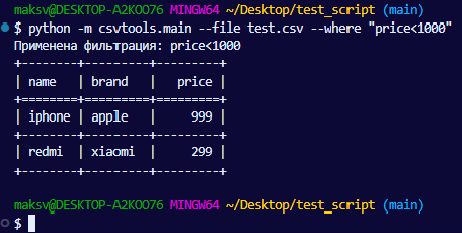
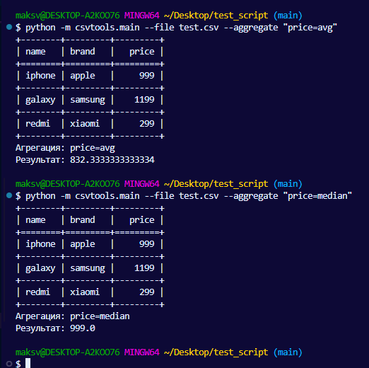
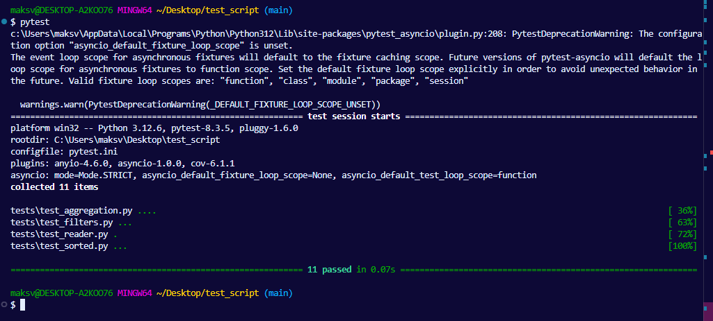
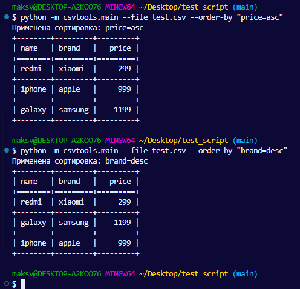

# CSV Processor CLI

Простой CLI-скрипт для работы с CSV-файлами: фильтрация строк по условию, агрегация числовых данных и сортировка.

---

## 📊 Возможности

- Фильтрация по колонке с операторами `=`, `<`, `>`
- Агрегация значений по колонке: `avg`, `min`, `max`, `median`
- Сортировка по колонке: `--order-by column=asc|desc`
- Чтение любых валидных CSV-файлов
- Простое расширение функционала
- Только стандартные библиотеки Python

---

## 📁 Структура проекта

```
project/
├── csvtools/
│   ├── __init__.py
│   ├── main.py           # точка входа
│   ├── cli.py            # разбор аргументов
│   ├── reader.py         # чтение CSV-файла
│   ├── filters.py        # фильтрация строк
│   ├── aggregators.py    # агрегация значений
│   ├── sorter.py         # сортировка по колонке
├── tests/
│   ├── test_reader.py
│   ├── test_filters.py
│   ├── test_aggregation.py
│   ├── test_sorter.py
├── test.csv              # пример CSV-файла
├── README.md
└── requirements.txt      # (может быть пустым)
```

---
## 📦 Установка

Установите зависимости командой:

```bash
pip install -r requirements.txt
```


## ⚡ Примеры запуска

### Содержимое `test.csv`

```csv
name,brand,price
iphone,apple,999
galaxy,samsung,1199
redmi,xiaomi,299
```

### 📌 Фильтрация

```bash
python -m csvtools.main --file test.csv --where "price<1000"
```

### 📌 Агрегация

```bash
python -m csvtools.main --file test.csv --aggregate "price=avg"
python -m csvtools.main --file test.csv --aggregate "price=median"
```

### 📌 Сортировка

```bash
python -m csvtools.main --file test.csv --order-by "price=asc"
python -m csvtools.main --file test.csv --order-by "brand=desc"
```

### 📌 Совмещенный запуск

```bash
python -m csvtools.main --file test.csv --where "brand=xiaomi" --aggregate "price=max" --order-by "price=desc"
```

---

## 🧪 Запуск тестов

```bash
pytest
```

---

## 💬 Примечания

- Все значения читаются как строки, агрегации приводят их к `float`
- Строки фильтруются по `=` (в точности)
- Агрегации применимы только к числовым колонкам
- Сортировка может быть по числовым и строковым значениям
- Архитектура проекта поддерживает добавление новых операций без переписывания существующего кода

---

## 📸 Скриншоты








Автор: Nakivaykka | Тестовое задание для Workmate | 26.06.2025

---